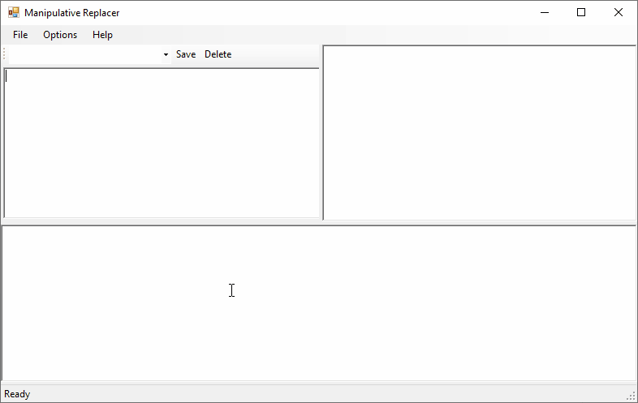
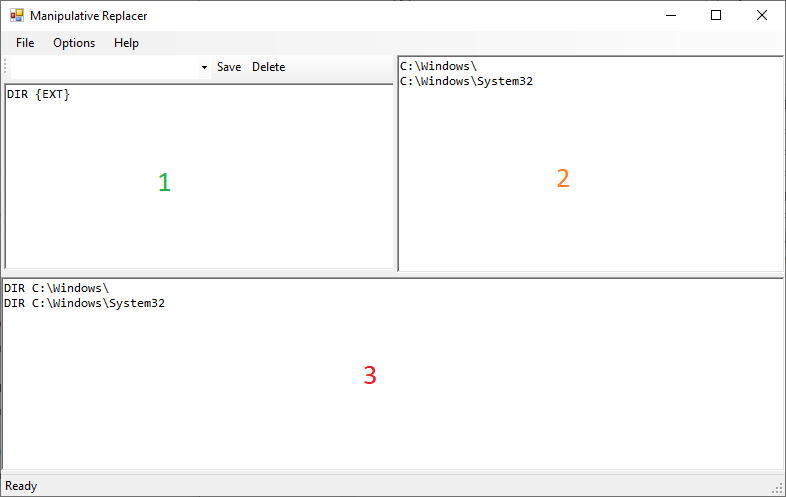

# ManipulativeReplacer
A Simple Program To Help With Bulk Data Manipulation Tasks.

This program was written to help me at work (and home), wherein I found myself in need of a quick way to generate several similar commands where only a single argument changed.

## Basic Usage
Here is a GIF of this in action:

The program is pretty straight forward; there are three "Panels" numbered in the following screenshot:

1. This is the `Pattern` panel
2. This is the `Input` panel
3. This is the `Output` panel

In the `Pattern` panel you put in whatever you want repeated, the keyword `{EXT}` is used to indicate where you want the values specified in the `Input` panel inserted. You can repeat the `{EXT}` keyword as many times as you want. This can have as many NewLines or exotic formatting as you wish and it will be repeated.

The `Input` panel is a NewLine delimited list of items that will be used as replacement values.

The `Output` panel will show the results of this operation (in real time). While it is editable any change to the `Pattern` or `Input` panels will regenerate this output.

## Bugs/Feature Requests
I accept pull requests and am responsive on GitHub, Let me know!

## License
This is licensed under the MIT License.
